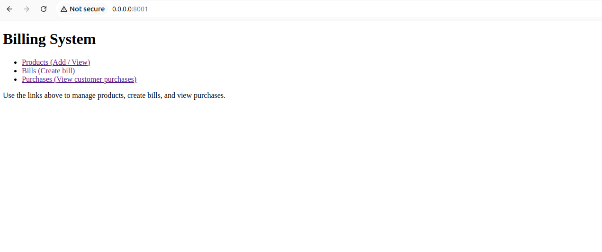
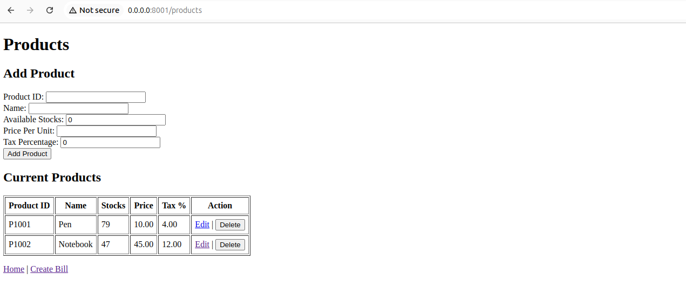
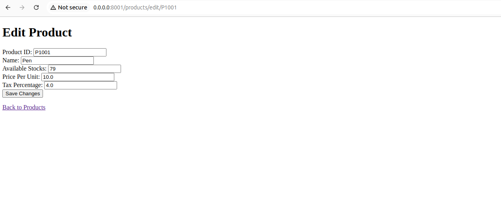
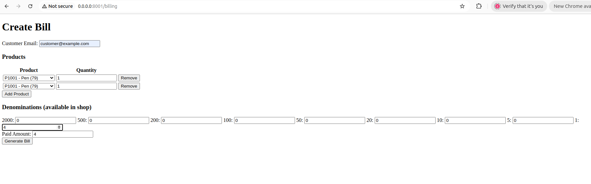
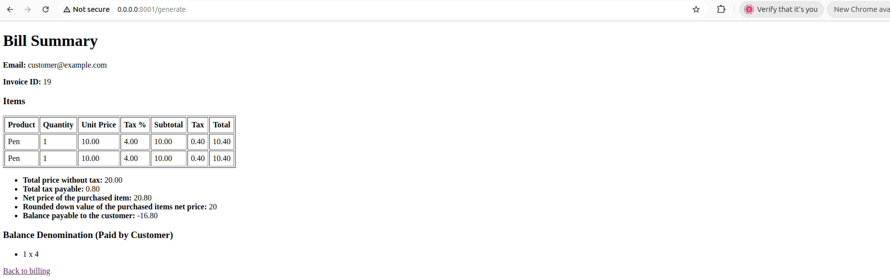
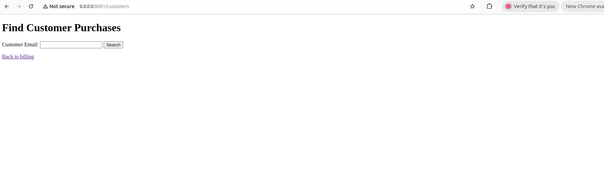
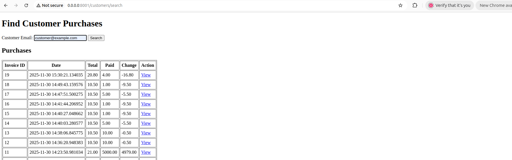

# FastAPI Billing System Documentation

## Overview

A production-ready billing system built with FastAPI.  
Features:
- Product and Denomination management
- Dynamic billing page with product selection, denomination input, and paid amount
- Automatic calculation of subtotal, tax, total, change, and denomination breakdown
- Purchase history per customer
- PDF invoice generation and email sending (background task)
> Place your screenshots in a `screenshots/` folder and reference them as shown below.
### 1. Home Page

Shows navigation links to Products, Billing, and Purchases.



---

### 2. Products Page

Add new products and view/edit current products.



---

### 3. Edit Product

Edit product details.



---

### 4. Billing Page

Enter customer email, add products, input denominations, and paid amount.



---

### 5. Bill Summary
Shows customer email, items in table, final calculations, denominations returned, and denominations paid.



---

### 6. Purchases Page

Search and view customer purchases in a table.



---

### 7. Purchase Detail

Shows details of a specific purchase.



---

## Setup & Usage

### Local Development
```bash
python -m venv .venv

docker compose up --build
```


---

## Features

- **Product Management:** Add, edit, and view products.
- **Billing:** Dynamic form for products, denominations, and paid amount.
- **Calculation:** Subtotal, tax, total, change, denomination breakdown.
- **Purchase History:** View all purchases by customer email.
- **PDF Invoice:** Generated and emailed asynchronously.
- **Docker Support:** Easy deployment with Docker Compose.

---

## Assumptions

- Uses SQLite by default. For production, switch to Postgres.
- Denominations are in whole units (e.g., rupees).
- Email sending requires valid SMTP credentials.

---

## Folder Structure

```
app/
  models.py
  crud.py
  utils.py
  email_utils.py
  seed.py
  templates/
    products.html
    product_edit.html
    billing.html
    summary.html
    purchases.html
    purchase_detail.html
requirements.txt
Dockerfile
docker-compose.yml
.env.example
README.md
screenshots/
```

---


